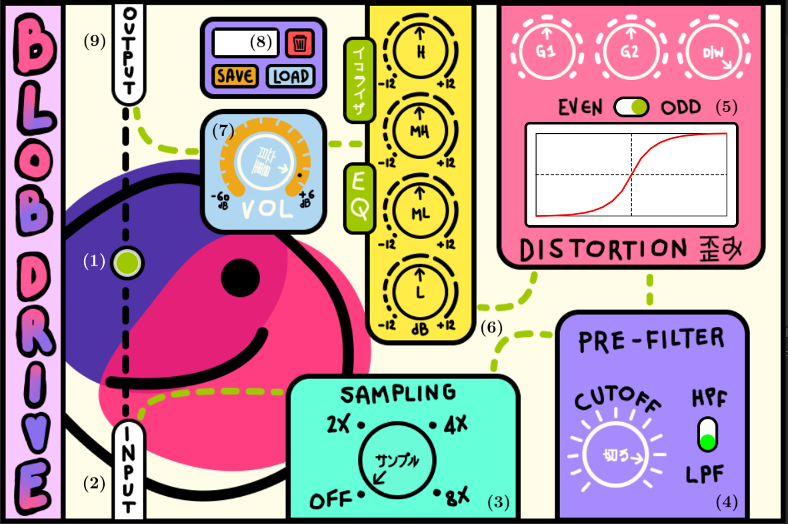

# BLOBDRIVE
<i>Group 10 - AKGigi</i>

  

## General infos
---
BlobDrive is distortion plug-in implemented with the application framework JUCE for homework #2 of Computer Music Languages and Systems. See the report in the project folder for further information.

## Folder Structure
---
In the GitHub repository you will find two folders: 
- Resources
- Source
- BlobDrive.jucer

In the resources folder you will find the images needed to build the GUI. In the source folder you will find the code components and the main code. 
The .jucer file is the one necessary to build the plugin.

## GUI Instructions
---

  

The boxes (input, sampling, pre-filtering, distortion, EQ, VOL, output) are organised in such a way as to show the path of the signal in the plug-in, like in a flow-chart.  
The starting point is the "input box" (2) from which the signal can go directly to the "output box" (9) through the bypass button (1) or continue towards the "sampling box" (3), where the upsampling factor can be set with a knob.   
The signal then continues towards the "pre-filter box" (4), in which the user can choose with a switch between an high-pass filter (HPF) or a low-pass filter (LPF) and set the cut-off frequency using a knob.   
Right after comes the "distortion box" (5), in which the user can modify the values of g1 and g2 (as defined in the report), choose the dry/wet proportion, decide the symmetry of the distortion function and visualize it in real time in a graph.   
In the "EQ box" (6) the user can choose the gain level of low (L), mid-low (ML), mid-high (MH) and high (H) frequencies, using the corresponding knobs.   
The last step in the path, before the "output box", is the "volume box" (7), consisting of a single knob that allows to control the output gain of the signal.   
Lastly, the "save/load box" (8) gives the user the possibility to upload a default plug-in preset, to delete a saved one or to save a new one locally in the BlobDrivePresets folder that will be automatically created in the documents folder of the PC.

## Plug-in Usage and Compatibility
---
To use the plug-in, please open BlobDrive.jucer with Visual Studio or Xcode (make sure that the Source and Resources folders are present, otherwise add them manually) and build the plug-in.   
We recommend the use of the DAW Reaper for best plug-in performance, but we also tested it with other DAWs (FL Studio, Logic, Garage Band).
Once you have built it, we also recommend to move it the in your system file folder.

## Group Components
---
- Riccardo Alfieri (riccardo.alfieri@mail.polimi.it)
- Riccardo Iaccarino (riccardo.iaccarino@mail.polimi.it)
- Manuele Montrasio (manuele.montrasio@mail.polimi.it)
- Silvio Sgotto (silvio.sgotto@mail.polimi.it)
- Francesco Veronesi (francesco2.veronesi@mail.polimi.it)